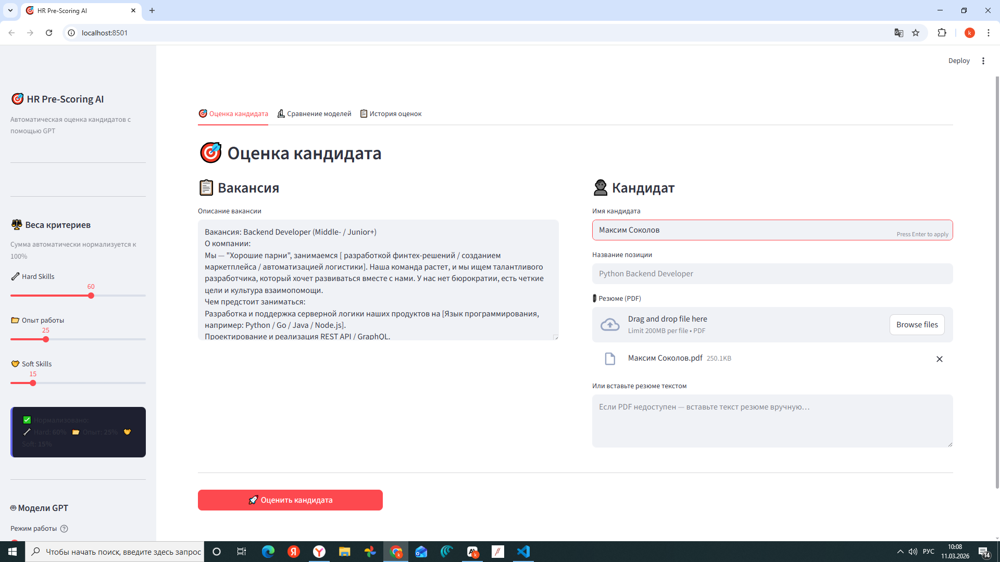
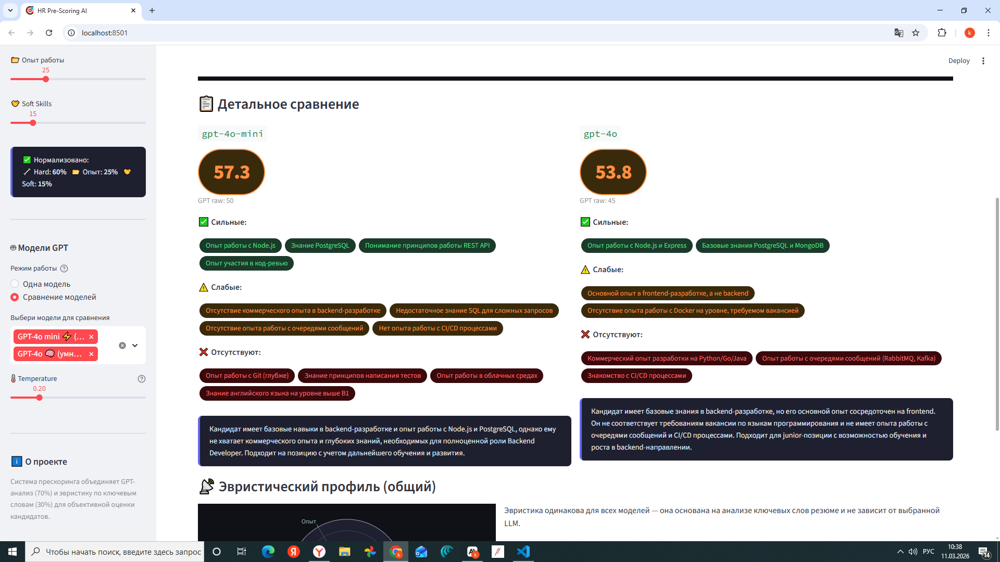
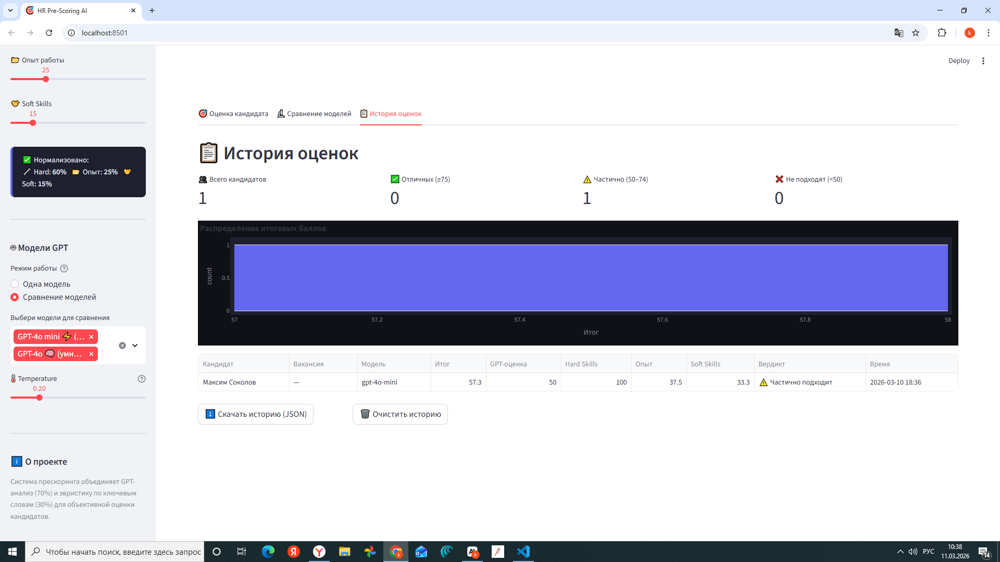

# 🎯 HR Pre-Scoring AI

> Автоматическая оценка кандидатов на соответствие вакансии с помощью GPT и эвристического анализа.

[](https://python.org)
[](https://streamlit.io)
[](https://openai.com)
[](LICENSE)

---

## 📌 Что это

Веб-сервис для автоматического **прескоринга кандидатов** — предварительной оценки резюме перед приглашением на интервью.

Система объединяет:
- **GPT-анализ** (семантическое понимание текста) — 70% веса
- **Эвристику по ключевым словам** (объективная проверка) — 30% веса

---

## ✨ Возможности

| Фича | Описание |
|------|----------|
| 📄 PDF-парсинг | Извлечение и очистка текста из резюме |
| 🤖 GPT-оценка | Структурированный анализ через OpenAI API |
| 🔬 Сравнение моделей | Запуск нескольких GPT-моделей параллельно |
| ⚖️ Динамические веса | Слайдеры Hard/Experience/Soft с авто-нормализацией |
| 📡 Radar-график | Визуальный профиль кандидата по категориям |
| 📋 История оценок | Персистентное хранение + экспорт в JSON |
| 🎨 Тёмный UI | Современный интерфейс на Streamlit + Plotly |

---

## 🏗️ Архитектура

```
hr-prescoring/
├── app.py           # Streamlit UI + логика страниц
├── parser.py        # PDF → очищенный текст
├── gpt_service.py   # OpenAI API-вызовы, repair JSON
├── scoring.py       # Эвристика по ключевым словам
├── models.py        # Датаклассы: Assessment, Weights, Result
├── history.py       # Сохранение / загрузка истории
├── requirements.txt
├── .env.example
└── README.md
```

### Pipeline обработки

```
Вакансия (текст) ──┐
                   ├─► GPT Service ──► structured JSON
Резюме (PDF/текст) ─┤                      │
                   └─► Heuristic Scorer    │
                              │            │
                              └────────────┴─► Final Score (0–100)
```

---

## 🚀 Быстрый старт

### 1. Клонировать репозиторий

```bash
git clone https://github.com/YOUR_USERNAME/hr-prescoring.git
cd hr-prescoring
```

### 2. Создать виртуальное окружение

```bash
python -m venv .venv
source .venv/bin/activate      # Linux / macOS
.venv\Scripts\activate         # Windows
```

### 3. Установить зависимости

```bash
pip install -r requirements.txt
```

### 4. Настроить переменные окружения

```bash
cp .env.example .env
# Открой .env и вставь свой OpenAI API Key
```

### 5. Запустить

```bash
streamlit run app.py
```

Браузер откроется автоматически на `http://localhost:8501`

---

## ⚙️ Конфигурация

### Смена провайдера API

Проект использует OpenAI, но адаптируется под любой совместимый API.
Измени в `gpt_service.py`:

```python
# Для совместимых провайдеров (например, Groq, Together AI):
client = OpenAI(
    api_key="your-key",
    base_url="https://api.groq.com/openai/v1",  # ← поменяй URL
)
```

### Добавить новую модель в UI

В `gpt_service.py`:

```python
AVAILABLE_MODELS = {
    "GPT-4o mini ⚡": "gpt-4o-mini",
    "GPT-4o 🧠":      "gpt-4o",
    "Моя модель 🆕":  "my-model-id",   # ← добавь сюда
}
```

---

## 🎯 Система оценки

### Весовая формула

```
Final Score = GPT_score × 0.70 + Heuristic_score × 0.30
```

### Эвристика (ключевые слова)

```
Heuristic = Hard_hits × W_hard + Exp_hits × W_exp + Soft_hits × W_soft
```

Веса настраиваются через слайдеры и **автоматически нормализуются** к 100%.

### Интерпретация

| Score | Вердикт |
|-------|---------|
| 75–100 | ✅ Отличный кандидат |
| 50–74  | ⚠️ Частично подходит |
| 0–49   | ❌ Не подходит |

---

## 📸 Скриншоты





---

## 🛠️ Технологии

- **Python 3.11+**
- **Streamlit** — веб-интерфейс без фронтенд-разработки
- **OpenAI API** — GPT-3.5-turbo / GPT-4o / GPT-4o-mini
- **pdfplumber** — парсинг PDF
- **Plotly** — интерактивные графики (gauge, radar, histogram)
- **pandas** — таблица истории

---

## 📝 Лицензия

MIT — используй свободно.

---

## 🙏 Вклад

PR и issues приветствуются!
Форкни репозиторий, создай ветку и отправь Pull Request.
